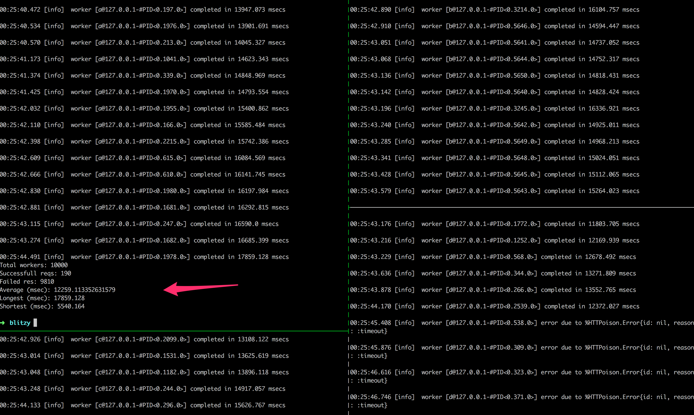
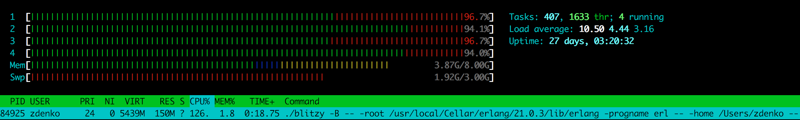

# Blitzy
CLI for testing speed / throughput for site (made by `The Little Elixir & OTP Guidebook`).
Learning basics how to implement a distributed, fault-tolerant application.

`./blitzy -n [requests] [url]`

Generate binary: `mix escript.build`

### Test via CLI
In three separate terminals, start the slave nodes:

```
% iex --name b@127.0.0.1 -S mix
% iex --name c@127.0.0.1 -S mix
% iex --name d@127.0.0.1 -S mix
```

The master node `a` is created from node started by CLI (in `main` method).
The nodes are defined in `config/config.exs`.

In another terminal, run the blitzy command:

```
% ./blitzy -n 10000 http://www.some-page.com
```

### Test it via terminals

Run 3 nodes each in separated terminals:

```
% iex --sname one -S mix
% iex --sname two -S mix
% iex --sname trhee -S mix
```

In terminal `one` run (change names of nodes by what terminals returned you from previous step):

```
iex(one@imac)> Node.connect(:two@imac)
true

iex(one@imac)> Node.connect(:three@imac)
true

iex(one@imac)> Node.list
[:two@imac, :three@imac]

iex(one@imac)> cluster = [node | Node.list]

# Run worker in each node as process
iex(one@imac)> :rpc.multicall(cluster, Blitzy.Worker, :start, ["http://www.some-page.cz"])

# Or you can run it w/o cluster. It will run it on each node in Node.list + in self node
iex(one@imac)> :rpc.multicall(Blitzy.Worker, :start, ["http://www.some-page.cz"])
```

### Blitzy in action


CPU load

